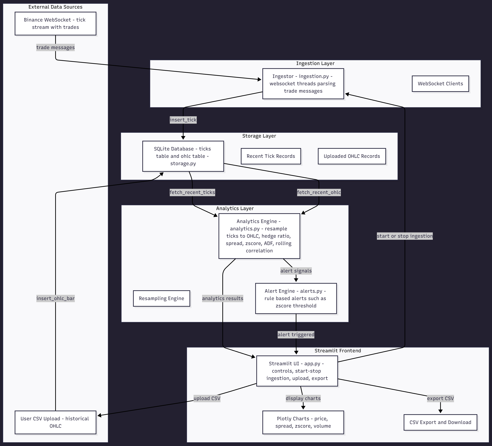

# Quant Analytics Platform

A real-time quantitative analytics dashboard for statistical arbitrage monitoring, built with Python and Streamlit.

## Features

- **Real-time Data Ingestion**: Connects to Binance WebSocket streams for live tick data.
- **Statistical Arbitrage Analytics**:
    - Cointegration tests (ADF)
    - Dynamic Hedge Ratio (OLS & Kalman Filter)
    - Spread & Z-Score monitoring
    - Rolling Correlation
- **Interactive Dashboard**:
    - Professional UI with dark mode
    - Real-time chart updates
    - Historical data upload & export
- **Alert System**: Configurable Z-score alerts.

## Architecture

The system follows a modular architecture:

- **`ingestion.py`**: Handles WebSocket connections and buffering.
- **`storage.py`**: Manages SQLite database for high-performance tick storage.
- **`analytics.py`**: Core quant logic (resampling, regression, filtering).
- **`app.py`**: Streamlit frontend for visualization and control.



## Setup & Run

1.  **Install Dependencies**:
    ```bash
    pip install -r requirements.txt
    ```

2.  **Run the App**:
    ```bash
    streamlit run app.py
    ```

3.  **Usage**:
    - Enter symbols (e.g., `btcusdt,ethusdt`) in the sidebar.
    - Click **Start** to begin ingestion.
    - Watch real-time analytics in the "Pair Analytics" tab.

## Methodology

### Data Processing
- **Ticks to OHLC**: Raw ticks are aggregated into time-based bars (1s, 1m, 5m) using `pandas.resample`.
- **Data Quality**: Filters applied for zero/negative prices and invalid timestamps.

### Analytics
- **Hedge Ratio**: Calculated using OLS regression ($P_1 = \beta \cdot P_2 + \epsilon$).
- **Z-Score**: $Z = \frac{Spread - \mu}{\sigma}$ over a rolling window.
- **Stationarity**: Augmented Dickey-Fuller (ADF) test to validate cointegration.
- **Mini Mean-Reversion Backtest**:
    - The backtest identifies moments when the spread between two assets becomes unusually far from its average  (high absolute z-score).
    - It opens a long or short spread position when this deviation occurs and closes the trade when the spread mean-reverts (z-score returns to zero).
    - PnL is computed from the simulated price changes of both legs using the OLS hedge ratio, producing an equity curve and trade statistics.

## AI Usage Transparency

This project utilized ChatGPT and Claude.ai for:
- **Boilerplate Code**: Generating initial Streamlit layout and SQLite schema.
- **Debugging**: Fixing pandas resampling edge cases and timezone issues.
- **Refactoring**: Improving code modularity and adding type hints.
- **Documentation**: Drafting the architecture diagram.
